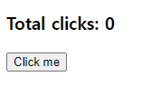
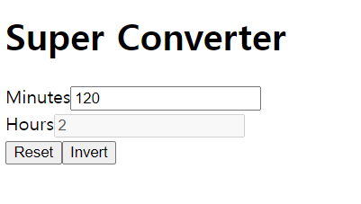
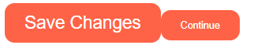
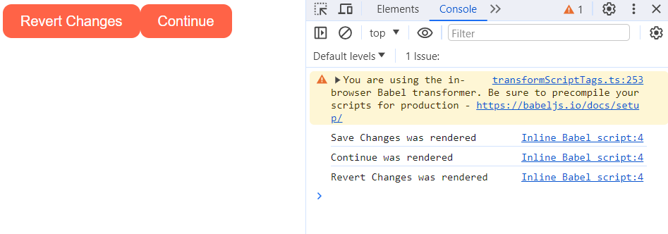
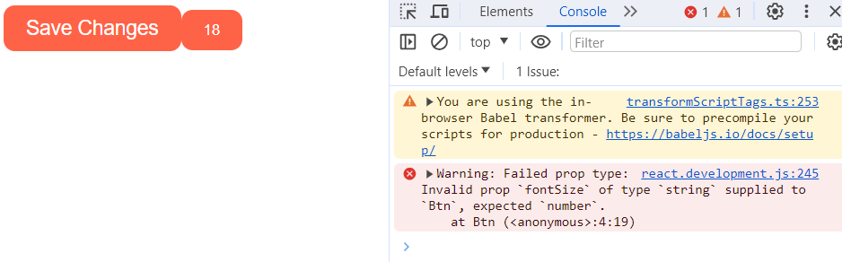
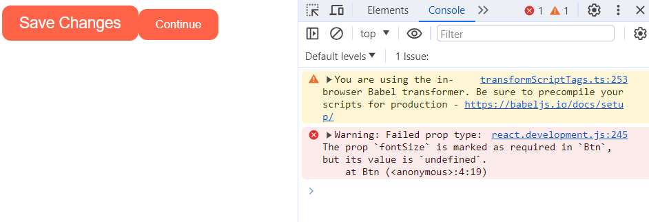

# ⭐React 기초⭐

### ✏️ Nomardcoder React로 영화 웹사이트 만들기 강의 중 리액트 정리

- `react-for-beginners` => `index.html`

# INTRO - 생략 가능

```html
<!DOCTYPE html>
<html>
  <body>
    <div id="root"></div>
  </body>
  <!-- react 가져오기 -->
  <script src="https://unpkg.com/react@17.0.2/umd/react.production.min.js"></script>
  <!-- reactDOM 가져오기  -->
  <script src="https://unpkg.com/react-dom@17.0.2/umd/react-dom.production.min.js"></script>
  <!-- 리액트 형식으로 쓴 코드를 babel 형식으로 바꾸기 -->
  <script src="https://unpkg.com/@babel/standalone/babel.min.js"></script>
  <script type="text/babel">
    //JSX
    const root = document.getElementById("root");

    //함수로 만들어줘야 밑에서 태그 형태로 사용 가능함
    function Title() {
      return (
        <h3 id="title" onMouseEnter={() => console.log("mouse enter")}>
          Hello I'm a title
        </h3>
      );
    }
    const Button = () => (
      <button
        style={{
          backgroundColor: "tomato",
        }}
        onClick={() => console.log("im clicked")}
      >
        Click me
      </button>
    );

    //어려운 방법

    //왼쪽 span은 아무 이름 상관 X
    //오른쪽 React.createElement()안에 들어가는 span은 html의 요소와 같아야 함
    // const h3 = React.createElement(
    //   "h3",
    //   {
    //     id: "title",
    //     onMouseEnter: () => console.log("mouse enter"),
    //   },
    //   "Hello I'm span"
    // );
    // const btn = React.createElement(
    //   "button",
    //   {
    //     onClick: () => console.log("im clicked"),
    //     style: {
    //       backgroundColor: "tomato",
    //     },
    //   },
    //   "Click me"
    // );
    const Container = () => (
      //여기서 주의할 점은 무조건!! 대문자로 시작해야 한다는 것. 소문자라면 html 태그로 착각
      <div>
        <button>Hello</button>
        <Title /> <Button />
      </div>
    );
    ReactDOM.render(<Container />, root);

    //render(): 보여준다
    //아래의 경우 sapn을 root에 넣어서 보여줄 거임. (여기서 root는 위에서 정의되어 있음)
    // ReactDOM.render(span, root);
  </script>
</html>
```

# REACT 시작

- 위의 INTRO 코드와 같은 것을 나타내는 정상적인(?) 리액트 코드

## 1. 리액트 기본



여기서 숫자 click me를 누르면 숫자 0이 하나씩 증가하는 코드

```html
<!DOCTYPE html>
<html>
  <body>
    <div id="root"></div>
  </body>
  <script src="https://unpkg.com/react@17.0.2/umd/react.production.min.js"></script>
  <script src="https://unpkg.com/react-dom@17.0.2/umd/react-dom.production.min.js"></script>
  <script src="https://unpkg.com/@babel/standalone/babel.min.js"></script>
  <script type="text/babel">
    //JSX
    const root = document.getElementById("root");

    function App() {
      // const data = React.useState(0);
      // const counter = data[0];
      // const modifier = data[1];

      //위의 3줄과 같은 의미
      //아래처럼 리액트 useState를 함으로써 렌더링을 반복해서 하지 않아도 알아서 바꿔줌
      //useState()안에 들어가는 값은 초기 counter의 값이고,  modifier은 counter 변수를 바꿔주는 함수
      //보통 modifier 대신 set+데이터이름을 사용함 (여기선 setCounter)
      const [counter, setCounter] = React.useState(0);

      const onClick = () => {
        setCounter(counter + 1);
      };

      //여기가 컴포넌트!
      return (
        <div>
          <h3>Total clicks: {counter}</h3>
          <button onClick={onClick}>Click me</button>
        </div>
      );
    }

    ReactDOM.render(<App />, root);
  </script>
</html>
```

## 2. state

- state 설정하는 법

1. `setCounter(112);` => 이렇게 값을 넣어주는 것
2. `setCounter(coutner+1);` => 이렇게 이전 값을 넣어서 바꾸는 것

그러나 2번에서 현재 state 바탕으로 다음 state를 계산하고 싶으면???

`setCounter((current) => current를 이용해 변화주는 식)`
2번 같은 경우에는 setCounter((current) => current+1)

- 리액트에서는 `current`가 확실히 현재 값이라고 보장함!!!!
- 예상하지 못한 업데이트가 일어나도 혼동을 주지 않음
- 이게 더 올바른 방법임

### ❗Inputs and State - 기본



분 => 시간으로 바꾸는 코드 짜기

#### ✅ html과 JSX 다른 점

1. html에서는 `class` 사용, JSX에서는 `className` 사용
2. html에서는 `for` 사용, JSX에서는 `htmlFor` 사용

#### ✅ 값이 바뀔 때 사용하는 건 `onChange`, 클릭할 때는 `onClick`, 마우스 커서 올리는 건 `onMouseEnter`

#### ✅ input 관련

```html
<input
  value="{minutes}"
  id="minutes"
  placeholder="Minutes"
  type="number"
  onChange="{onChange}"
/>
```

- 여기서 `value="{minutes}"` 이건 UI로 보여주는 것. 즉, 어떤 걸 화면에 보여줄 것인지.
- `onChange="{onChange}"` 이건 업데이트해주는 함수
- 만약 value가 상황마다 바뀌어서 if문을 쓰고 싶다면?

  - `value={flipped ? amount : Math.round(amount / 60)}` 이렇게 사용하기

#### 4. 버튼 이름 if문

```html
<button onClick="{onFlip}">{inverted ? "Turn back" : "Invert"}</button>
```

- inverted가 true면 "Turn back" 이라는 이름으로 버튼 이름이 바뀌고, false면 "Invert"라는 이름으로 버튼 이름이 바뀜

#### 전체 코드

```js
const root = document.getElementById("root");

function App() {
  //반응형 변수를 만든다고 생각하면 될 듯.
  const [amount, setAmount] = React.useState();
  const [inverted, setinverted] = React.useState(false);

  const onChange = (evnet) => {
    //event.target.value로 input에 입력한 value를 가져올 수 있음
    setAmount(event.target.value);
  };

  const reset = () => {
    setAmount(0);
  };

  const onInvert = () => {
    setinverted((current) => !current);
    reset();
  };

  return (
    <div>
      <h1 className="hi">Super Converter</h1>
      <div>
        <label htmlFor="minutes">Minutes</label>
        <input
          value={inverted ? amount * 60 : amount}
          id="minutes"
          placeholder="Minutes"
          type="number"
          onChange={onChange}
          disabled={inverted}
        />
      </div>
      <div>
        <label htmlFor="hours">Hours</label>
        <input
          value={inverted ? amount : Math.round(amount / 60)}
          id="hours"
          placeholder="Hours"
          type="number"
          disabled={!inverted}
          onChange={onChange}
        />
      </div>
      <button onClick={reset}>Reset</button>
      <button onClick={onInvert}>{inverted ? "Turn back" : "Invert"}</button>
    </div>
  );
}

ReactDOM.render(<App />, root);
```

### ❗ Inputs and State - 심화

- 변환기 2개, 메뉴바 생성

```js
function MinutesToHours() {} // 바뀐 것 거의 없음. 기존 function app()부분을 이름만 MinutesToHours()로 바꿈. 이 안의 코드 생략

// 킬로미터 <=> 마일 바꿀 거
function KmToMiles() {
  return <h3>KM 2 M</h3>;
}

// 여기에 이제 select를 통해서 밑 화면 나오는 걸 바꿀 것임
function App() {
  //여기 있는 index는 밑의 select에 연결할 거임
  const [index, setIndex] = React.useState("xx");
  const onSelect = (event) => {
    setIndex(event.target.value);
  };

  //html 코드를 return 해야 하는데, hr 태그 밑을 보면 if문을 써야 함.
  //이때 `{}` 안에 자바스크립트 문장을 쓰면 됨
  return (
    <div>
      <h1>Super Converter</h1>
      <select value={index} onChange={onSelect}>
        <option value="xx">Select your units</option>
        <option value="0">Minutes & Hours</option>
        <option value="1">Km & Miles</option>
      </select>
      <hr />
      {index == "xx" ? "Please select your units" : null}
      {index == "0" ? <MinutesToHours /> : null}
      {index == "1" ? <KmToMiles /> : null}
    </div>
  );
}
```

## 3. Props

### ✅ props 기초


```js
//요렇게 만든 게 컴포넌트임
//버튼 스타일은 똑같고 안에 텍스트만 다르게 할 Btn 컴포넌트 생성
function Btn(props) {
  //props는 아래 App()에서 해당 컴포넌트(Btn) 부를 때 안에 넣으면 다 받아오는 애임
  console.log(props); //{ "banana": "Save Changes"} 라고 찍힘

  return (
    <button
      style={{
        backgroundColor: "tomato",
        color: "white",
        padding: "10px 20px",
        border: 0,
        borderRadius: 10,
      }}
    >
      {props.banana}
    </button>
  );
}

function App() {
  return (
    <div>
      <Btn banana="Save Changes" />
      <Btn banana="Continue" />
    </div>
  );
}

const root = document.getElementById("root");
ReactDOM.render(<App />, root);
```

### ✅ shortcut



```js
//아예 받을 때 {banana} 이렇게 받아서 props.banana 할 필요 없도록 받는 것이 shortcut
// 인자 두 개 받고 싶다면 아래처럼 쓰면 됨
function Btn({ text, big }) {
  return (
    <button
      style={{
        backgroundColor: "tomato",
        color: "white",
        padding: "10px 20px",
        border: 0,
        borderRadius: 10,
        // 버튼 안에 big이 true면 크게, big이 false면 작게 만들게 할 수도 있음
        fontSize: big ? 18 : 10,
      }}
    >
      {text}
    </button>
  );
}

function App() {
  return (
    <div>
      <Btn text="Save Changes" big={true} />
      <Btn text="Continue" big={false} />
    </div>
  );
}

const root = document.getElementById("root");
ReactDOM.render(<App />, root);
```

### ✅ Memo

props가 변경되지 않는다면 컴포넌트를 다시 그리지 않아도 되게 하는 애



```js
function Btn({ text, changeValue }) {
  console.log(text, "was rendered");
  return (
    <button
      onClick={changeValue}
      style={{
        backgroundColor: "tomato",
        color: "white",
        padding: "10px 20px",
        border: 0,
        borderRadius: 10,
        fontSize: 16,
      }}
    >
      {text}
    </button>
  );
}

//이게 React memo!!!! 중요중요
const MemorizeBtn = React.memo(Btn);

//아래의 changeValue은 이벤트리스너가 아니고 단순히 props 이름임
//onClick이 들어가도 여전히 props 이름임
function App() {
  //setValue가 실행되면 value가 들어가는 return문이 전체가 다시 실행됨.
  //changeValue를 실행할 때마다 관계 없는 2번째 버튼인 Continue도 계속 갱신된다는 소리
  //이때 React Memo를 사용할 수 있음
  const [value, setValue] = React.useState("Save Changes");
  const changeValue = () => setValue("Revert Changes");
  return (
    <div>
      <MemorizeBtn text={value} changeValue={changeValue} />
      <MemorizeBtn text="Continue" />
    </div>
  );
}

const root = document.getElementById("root");
ReactDOM.render(<App />, root);
```

### ✅ Prop Types

만약 prop을

```js
<Btn text="Save Changes" fontSize={18} />
```

이렇게 보내야 하는데

```js
<Btn text="18" fontSize={"Save Changes"} />
```

이렇게 보낼 때, React는 뭐가 잘못된지 모름! 문법상 틀린 게 없어서

그런데 절대 제대로 실행이 안 될 것임!!

이걸 위해 리액트에서 props 타입이 뭔지 제공해줌

아래의 스크립트 추가

```js
<script src="https://unpkg.com/prop-types@15.7.2/prop-types.js"></script>
```

- props 타입을 잘못 줬을 때 나오는 오류
  

  ```js
  Btn.propTypes = {
      text: PropTypes.string,
      fontSize: PropTypes.number,
    };
    .
    .
    .

  <Btn text="Save Changes" fontSize={18} />
  <Btn text="18" fontSize={"Save Changes"} />
  ```

- `isRequired`한 prop 안 썼을 때 나는 오류

  

  ```js
  Btn.propTypes = {
      text: PropTypes.string,
      fontSize: PropTypes.number.isRequired,
    };

  .
  .
  .

  <Btn text="Save Changes" fontSize={18} />
  <Btn text="Continue" />
  ```

### ✅ prop의 default 값 설정

```js
function Btn({ text, fontSize = 16 }) {}
```

이렇게 할 수 있음

### 4, 5 전체 코드

```html
<!DOCTYPE html>
<html>
  <body>
    <div id="root"></div>
  </body>
  <script src="https://unpkg.com/react@17.0.2/umd/react.development.js"></script>
  <script src="https://unpkg.com/react-dom@17.0.2/umd/react-dom.production.min.js"></script>
  <script src="https://unpkg.com/@babel/standalone/babel.min.js"></script>
  <script src="https://unpkg.com/prop-types@15.7.2/prop-types.js"></script>
  <script type="text/babel">
    function Btn({ text, fontSize = 16 }) {
      return (
        <button
          style={{
            backgroundColor: "tomato",
            color: "white",
            padding: "10px 20px",
            border: 0,
            borderRadius: 10,
            fontSize: fontSize,
          }}
        >
          {text}
        </button>
      );
    }

    //이렇게 검사를 하려고 하는 컴포넌트에 propTypes를 정의함
    Btn.propTypes = {
      text: PropTypes.string.isRequired,
      fontSize: PropTypes.number,
    };

    function App() {
      //fontSize는 {}로 보내는 이유: 18을 숫자로 보내야 하는데 "18"로 보내면 문자열로 인식해서
      return (
        <div>
          <Btn text="Save Changes" fontSize={18} />
          <Btn text="Continue" />
        </div>
      );
    }

    const root = document.getElementById("root");
    ReactDOM.render(<App />, root);
  </script>
</html>
```
