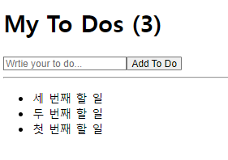
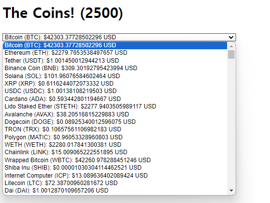

# 리액트 공부 2

- `react-for-beginners2` 디렉토리 파일

## Effect

### 특정 코드가 처음 렌더링 때만 실행되게 하기

특정 코드가 첫 번째 component render에서만 실행되게 하는지에 대한 방법

- 원래는 state가 변경 될때마다 render 됨

#### 1. useEffect 가져오기

```js
import { useState, useEffect } from "react";
```

#### 2. useEffect 사용하기

`useEffect(한 번만 사용할 함수, [])`

```js
const iRunOnlyOne = () => {
  console.log("i run only once");
};
useEffect(iRunOnlyOne, []);
```

위와 같은 코드

```js
useEffect(() => {
  console.log("CALL THE API...");
}, []);
```

`App.js` 코드

```js
import { useState, useEffect } from "react";

function App() {
  const [counter, setValue] = useState(0);

  const onClick = () => {
    setValue((prev) => prev + 1);
  };

  console.log("i run all the time");

  // const iRunOnlyOne = () => {
  //   console.log("i run only once");
  // };
  // useEffect(iRunOnlyOne, []);

  //위 코드 4줄과 같은 의미
  useEffect(() => {
    console.log("CALL THE API...");
  }, []);

  return (
    <div>
      <h1>{counter}</h1>
      <button onClick={onClick}>click me</button>
    </div>
  );
}

export default App;
```

### 특정한 부분이 변화했을 때, 원하는 코드 실행하기

`useEffect(사용할 함수, [변화하는 부분])`

```js
//키워드가 바뀔 때만 render 됨
useEffect(() => {
  if (keyword !== "" && keyword.length > 5) {
    console.log("SEARCH FOR", keyword);
  }
}, [keyword]);
```

- 2개 이상도 가능

```js
useEffect(() => {
  console.log("I run when keyword & counter changes.");
}, [keyword, counter]);
```

App.js 전체 코드

```js
import { useState, useEffect } from "react";

function App() {
  const [counter, setValue] = useState(0);
  const [keyword, setKeyword] = useState("");

  const onClick = () => {
    setValue((prev) => prev + 1);
  };

  const onChange = (event) => {
    setKeyword(event.target.value);
  };

  console.log("i run all the time");

  useEffect(() => {
    console.log("i run only once");
  }, []);

  //키워드가 바뀔 때만 검색을 하고 싶음!!
  useEffect(() => {
    console.log("I run when 'keyword' changes.");
  }, [keyword]);

  useEffect(() => {
    console.log("I run when 'counter' changes.");
  }, [counter]);

  useEffect(() => {
    console.log("I run when keyword & counter changes.");
  }, [keyword, counter]);

  return (
    <div>
      <input
        value={keyword}
        onChange={onChange}
        type="text"
        placeholder="Search here..."
      ></input>
      <h1>{counter}</h1>
      <button onClick={onClick}>click me</button>
    </div>
  );
}

export default App;
```

### Cleanup Function

`useEffect(함수(){ retrun(){이 부분에 넣는 코드는 component가 사라질 때 실행됨}}, [바뀔부분])`

App.js 코드

```js
import { useState, useEffect } from "react";

function Hello() {
  // function byeFn() {
  //   return () => console.log("bye :(");
  // }

  // function hiFn() {
  //   console.log("created :)");

  //   //useEffect의 인자로 전해지는 함수가 return 되는 부분은 component가 destroy 할때 실행
  //   return byeFn();
  // }
  // useEffect(hiFn, []);

  //보통 아래처럼 useEffect() 안에 코드를 다 넣음
  useEffect(() => {
    console.log("hi :)");

    //해당 컴포넌트 destroy 될 때 실행
    return () => console.log("bye :(");
  }, []);

  return <h1>Hello</h1>;
}

function App() {
  const [showing, setShowing] = useState(false);
  const onClick = () => {
    setShowing((prev) => !prev);
  };

  return (
    <div>
      {showing ? <Hello /> : null}
      <button onClick={onClick}>{showing ? "Hide" : "Show"}</button>
    </div>
  );
}

export default App;
```

## 간단한 To Do List 만들기



- `배열.map((요소)=> (요소 하나씨 돌면서 할 것))`
  - 배열을 for문 돌리는 것과 같음

```js
import { useState } from "react";

function App() {
  const [toDo, setToDo] = useState("");
  const [toDos, setToDos] = useState([]);
  const onChange = (event) => {
    setToDo(event.target.value);
  };
  const onSubmit = (event) => {
    event.preventDefault();
    if (toDo === "") {
      return;
    }
    //현재 가지고 있는 배열 + toDo에 입력한 단어를 toDos에 넣기
    setToDos((currentArray) => [toDo, ...currentArray]);
    setToDo("");
  };

  return (
    <div>
      <h1>My To Dos ({toDos.length})</h1>
      <form onSubmit={onSubmit}>
        <input
          onChange={onChange}
          value={toDo}
          type="text"
          placeholder="Wrtie your to do..."
        ></input>
        <button>Add To Do</button>
      </form>
      <hr />
      <ul>
        {toDos.map((item, index) => (
          <li key={index}>{item}</li>
        ))}
      </ul>
    </div>
  );
}

export default App;
```

## 간단한 Coin Tracker 만들기



```js
import { useEffect, useState } from "react";

function App() {
  const [loading, setLoading] = useState(true);
  //useState() 안에는 꼭 []든 ""든 뭐든 넣어줘야 함
  const [coins, setCoins] = useState([]);
  useEffect(() => {
    fetch("https://api.coinpaprika.com/v1/tickers")
      .then((response) => response.json())
      .then((json) => {
        setCoins(json);
        setLoading(false);
      });
  }, []);

  return (
    <div>
      <h1>The Coins! {loading ? "" : `(${coins.length})`}</h1>
      {loading ? (
        "Loading..."
      ) : (
        <select>
          {coins.map((coin) => (
            <option key={coin.id}>
              {coin.name} ({coin.symbol}): ${coin.quotes.USD.price} USD
            </option>
          ))}
        </select>
      )}
    </div>
  );
}

export default App;
```

## 영화 웹사이트 만들기

### 리액트 라우터 (기본)

[공식 튜토리얼 사이트 ](https://v5.reactrouter.com/web/guides/quick-start)

#### 1. 설치

```
npm install react-router-dom
```

#### 2. 임포트

```js
import { BrowserRouter as Router, Switch, Route, Link } from "react-router-dom";
```

BrowserRouter vs HashRouter

- HashRouter의 경우 처음 페이지 들어가면 주소에 `/#/`이 붙음
  - `http://localhost:3000/#/`
- 보통 BrowserRouter을 사용함

#### 3. 코드 적기

**✅Route 생성**

예시)

1. 유저가 홈화면으로 갈 때 사용할 Route

2. /movie 했을 때 가는 Route

App.js

```js
import { BrowserRouter as Router, Switch, Route } from "react-router-dom";
import Home from "./routes/Home";
import Detail from "./routes/Dtail";

function App() {
  return (
    <Router>
      <Switch>
        <Route path="/movie">
          <Detail />
        </Route>
        <Route path="/">
          <Home />
        </Route>
      </Switch>
    </Router>
  );
}

export default App;
```

**✅Route에서 Route로 가는 방법**

Link 컴포넌트 이용!!

Movie.js 코드

1. Link 임포트

```js
import { Link } from "react-router-dom";
```

2. 해당 부분에 코드 작성

```js
<h2>
  <Link to="/movie">{title}</Link>
</h2>
```

### 동적 라우터

App.js 코드 아래처럼 바꾸기

```js
<Route path="/movie/:id">
  <Detail />
</Route>
```

동적 라우터에 이용할 id를 prop으로 추가해서 가져오기

Movie.js 코드 작성은 다음과 같음

```js
<h2>
  <Link to={`/movie/${id}`}>{title}</Link>
</h2>
```

Movie.js에서 보내는 id를 Detail.js에서도 알아야 쓸 수 있음!!

그래서 url에 있는 애를 가져오기 위해선 `useParams`를 사용함

- useParams 임포트
  ```js
  import { useParams } from "react-router-dom";
  ```
  
**참고**
- route 사용했을 때 다른 방법
  ```js
    <Route path="/" element={<Main />} />
  ```

## github-page

1. package.json 맨 밑에 다음과 같은 코드 추가

```json
"homepage": "https://JHyeon-a.github.io/Nomadcoders_reactJS"
```

2. package.json - script에 코드 추가

```json
 "scripts": {
    "start": "react-scripts start",
    "build": "react-scripts build",
    "test": "react-scripts test",
    "eject": "react-scripts eject",
    //이 아래 deploy, predeploy!!! 추가!
    "deploy": "gh-pages -d build",
    "predeploy": "npm run build"
  },
```

3. 터미널에 입력

```
npm run deploy
```

끝!!!
